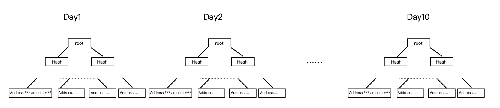
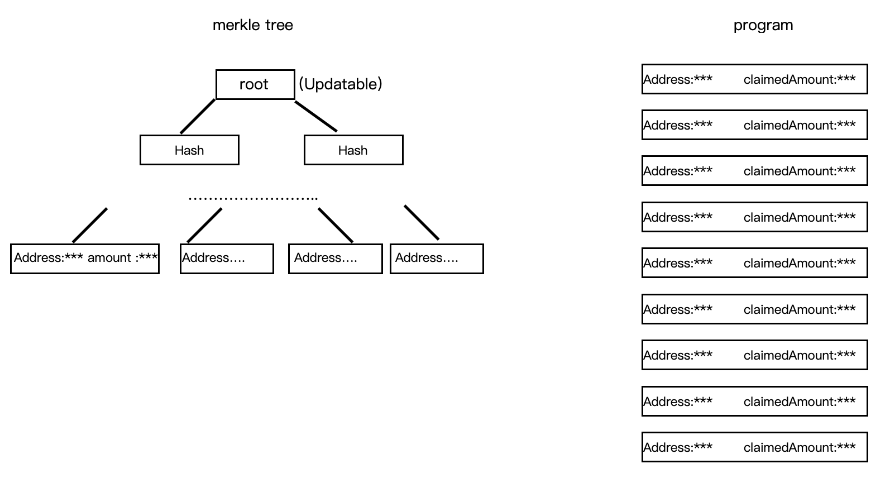

# 一个可持续分发空投的merkle-distributor

本文将介绍PNG团队基于[Uniswap](https://github.com/Uniswap/merkle-distributor) 和
[saber](https://github.com/saber-hq/merkle-distributor) 开源的merkle-distributor的一个改进版本

## 前言
上个月，我们与[bunnyducky](https://app.bunnyducky.com/) 合作的bonding项目上线之后，bunnyducky做了一个空投活动。
该活动基于用户farm的金额，每天空投一定数量的sbud token，空投的实现方式基于merkle-distributor。  
活动上线后，我们的社区不断接到用户反馈空投的体验太差，其中大部分的反馈可以归结到2点。  
1.用户每天都需要claim一次空投，比较麻烦。2.有的用户由于farm的金额较少，每天claim获得的token价值甚至不够覆盖gas费。

## 解决方案
我们通过调研和审查代码发现，用户体验差的主要原因在于我们的空投方式是每天一次空投，而且每次空投都重新提交一棵merkle tree

旧的空投方式

于是我们开始着手改进空投机制。  
最初我们团队尝试在前端将多笔交易打包合并来解决这个问题，但是由于proof需要的字节数量比较多，在打包2-3笔交易之后就会超出交易容量。  
后来我们也尝试将proof的字节缩短从而打包更多交易，但是这种方式也没能带来多大的性能提升，而且还牺牲了至关重要的安全性。  
最后我们找到了解决方案：[png-merkle-distributor](https://github.com/pngfi/merkle-distributor)

png-merkle-distributor

这是一个可以更新root的merkle-distributor，同时在用户的claim_status里面记录用户的历史claimed数量。有了这样的设计之后，
项目方每天发布空投，只需要更新一下merkle树的root即可，但是需要注意的是merkle树的叶子节点是由用户地址+历史可claim的总量构成，
每天需要更新proof数量是最新的总量，由于我们在claim_status里面记录了claimed数量，所以用户真实的可领取数量为

<code>  
claim_amount = amount_proof-claim_status.claimed_amount  
</code>

当用户觉得可claim的数量太少，那么他们可以等待几天，等claim数量更多了再领取。  
通过这个方案我们成功的解决了上述问题。

## 适合的场景
当项目方需要多次空投的时候，本方案会拥有更好的用户体验，而且能更好的节省项目方的成本。在旧的方案中，一次空投就需要部署一次合约，
而我们的方案只需要部署一次，还可以进行重复使用。

## 团队
Penguin Finance [website](png.fi) [twitter](https://twitter.com/png_fi)  
bunnyducky [website](https://bunnyducky.com/) [twitter](https://twitter.com/BunnyDuckyHQ)

